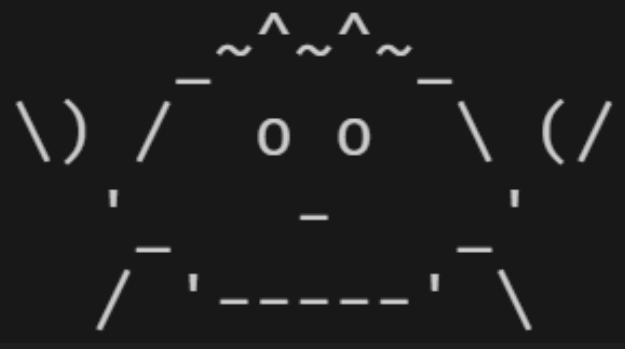
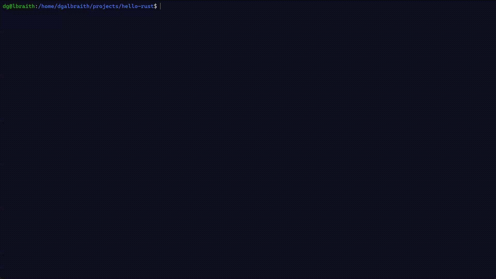

<a name="readme-top"></a>

[![Contributors][contributors-shield]][contributors-url]
[![Forks][forks-shield]][forks-url]
[![Stargazers][stars-shield]][stars-url]
[![Issues][issues-shield]][issues-url]
[![MIT License][license-shield]][license-url]
[![LinkedIn][linkedin-shield]][linkedin-url]

<br />
<div align="center">
  <a href="https://github.com/dgalbraith/hello-rust">
    
  </a>

<h3 align="center">Hello, Rust!</h3>

  <p align="center">
    The eponymous Hello World written in ideomatic Rust
    <br />
  </p>
</div>

<details>
  <summary>Table of Contents</summary>
  <ol>
    <li>
      <a href="#about-the-project">About The Project</a>
      <ul>
        <li><a href="#built-with">Built With</a></li>
      </ul>
    </li>
    <li>
      <a href="#getting-started">Getting Started</a>
      <ul>
        <li><a href="#prerequisites">Prerequisites</a></li>
        <li><a href="#installation">Installation</a></li>
      </ul>
    </li>
    <li><a href="#usage">Usage</a></li>
    <li><a href="#roadmap">Roadmap</a></li>
    <li><a href="#contributing">Contributing</a></li>
    <li><a href="#license">License</a></li>
    <li><a href="#contact">Contact</a></li>
  </ol>
</details>

## About The Project

[![Hello Rust Screen Shot][product-screenshot]](https://github.com/dgalbraith/hello-rust)

An implementation of Hello World using the [Rust Programming Language](https://www.rust-lang.org/).

<p align="right">(<a href="#readme-top">back to top</a>)</p>

### Built With

* [![Rust][Rust.js]][Rust-url]

<p align="right">(<a href="#readme-top">back to top</a>)</p>

## Getting Started

To get a local copy up and running follow these steps:

### Prerequisites

Set up a Rust development environment.

* Follow the instructions on the [main installation page](https://www.rust-lang.org/learn/get-started)
or use one of the [alternate installation methods](https://forge.rust-lang.org/infra/other-installation-methods.html)

### Installation

1. Clone the repository
   ```sh
   git clone https://github.com/dgalbraith/hello-rust.git
   cd hello-rust
   ```
2. Build the project with
   ```sh
   cargo build
   ```
3. Test the project with
   ```sh
   cargo test
   ```
4. Run the project with
   ```sh
   cargo run
   ```

<p align="right">(<a href="#readme-top">back to top</a>)</p>

## Usage

```sh
$ cargo run
    Finished dev [unoptimized + debuginfo] target(s) in 0.01s
     Running `target/debug/hello-rust`
 _______________
< Hello, world! >
 ---------------
        \
         \
            _~^~^~_
        \) /  o o  \ (/
          '_   -   _'
          / '-----' \
$
```
<p align="right">(<a href="#readme-top">back to top</a>)</p>

## Demo

<a href="https://github.com/dgalbraith/hello-rust">
  
</a>

<p align="right">(<a href="#readme-top">back to top</a>)</p>

## Roadmap

See the [open issues](https://github.com/dgalbraith/hello-rust/issues) for a full list of proposed features (and known issues).

<p align="right">(<a href="#readme-top">back to top</a>)</p>

## Contributing

Any contributions are more than welcome.

If you have a suggestion that would make this better, please fork the repo and create a pull request. You can also simply open an issue with the tag "enhancement".

1. Fork the Project
2. Create your Feature Branch (`git checkout -b feature/NewFeature`)
3. Commit your Changes (`git commit -m 'Add some New Feature'`)
4. Push to the Branch (`git push origin feature/NewFeature`)
5. Open a Pull Request

<p align="right">(<a href="#readme-top">back to top</a>)</p>

## License

Distributed under the MIT License. See [`LICENSE.txt`](https://github.com/dgalbraith/hello-rust) for more information.

<p align="right">(<a href="#readme-top">back to top</a>)</p>

## Contact

David Galbraith - [@djdgalbraith](https://twitter.com/djdgalbraith) - dg@lbraith.io

Project Link: [https://github.com/dgalbraith/hello-rust](https://github.com/dgalbraith/hello-rust)

<p align="right">(<a href="#readme-top">back to top</a>)</p>

<!-- Links and images -->
[contributors-shield]: https://img.shields.io/github/contributors/dgalbraith/hello-rust.svg?style=flat
[contributors-url]: https://github.com/dgalbraith/hello-rust/graphs/contributors
[forks-shield]: https://img.shields.io/github/forks/dgalbraith/hello-rust.svg?style=flat
[forks-url]: https://github.com/dgalbraith/hello-rust/network/members
[stars-shield]: https://img.shields.io/github/stars/dgalbraith/hello-rust.svg?style=flat
[stars-url]: https://github.com/dgalbraith/hello-rust/stargazers
[issues-shield]: https://img.shields.io/github/issues/dgalbraith/hello-rust.svg?style=flat
[issues-url]: https://github.com/dgalbraith/hello-rust/issues
[license-shield]: https://img.shields.io/github/license/dgalbraith/hello-rust.svg?style=flat
[license-url]: https://github.com/dgalbraith/hello-rust/blob/main/LICENSE.txt
[linkedin-shield]: https://img.shields.io/badge/-LinkedIn-black.svg?style=flat&logo=linkedin&colorB=555
[linkedin-url]: https://linkedin.com/in/djdgalbraith
[Rust.js]: https://img.shields.io/badge/Rust-0769AD?style=flat&logo=rust&logoColor=white
[Rust-url]: https://www.rust-lang.org/
[product-screenshot]: images/screenshot.png
